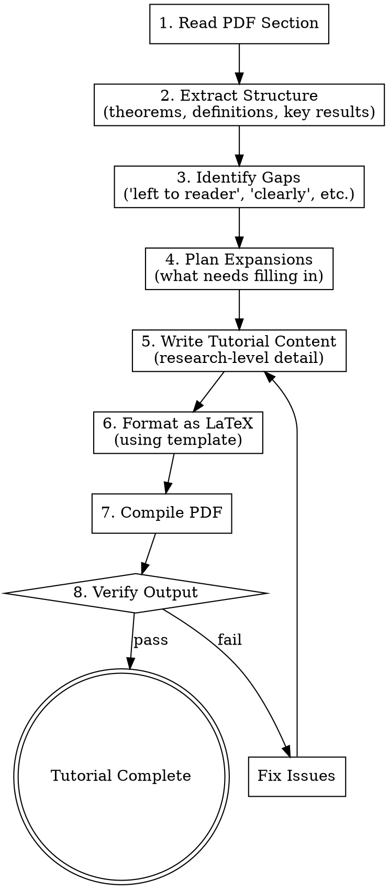

# Physics Textbook to Tutorial Converter

Transform terse physics textbook sections into comprehensive research-level tutorials with complete proofs, detailed derivations, and professional LaTeX formatting.

## When to Use This Skill

Invoke this skill when:
- Converting physics/math textbook PDFs to expanded tutorials
- User asks to "explain", "expand", or "fill in" textbook content
- Creating tutorial materials from academic sources
- Filling in "left to the reader" proofs

## Core Workflow



## Step-by-Step Process

### Step 1: Read and Analyze Source

1. Read the PDF section using the Read tool
2. Identify the chapter/section structure
3. Note all mathematical content:
   - Definitions
   - Theorems and lemmas
   - Proofs (complete or sketched)
   - Examples
   - Equations to reference

### Step 2: Identify Gaps

Look for these **gap markers** that indicate content needing expansion:

| Gap Marker | Meaning | Action |
|------------|---------|--------|
| "Left to the reader" | Missing proof | Write complete proof |
| "Clearly" / "Obviously" | Skipped justification | Provide explicit reasoning |
| "It is easy to show" | Missing derivation | Show the full derivation |
| "Using Eq. (X), we get" | Skipped algebra | Show all intermediate steps |
| "Similarly" / "Likewise" | Pattern assumed | Write out the similar case |
| "Straightforward calculation" | Missing computation | Do the computation |
| Long equation jumps | Skipped steps | Fill in intermediate equations |

### Step 3: Plan the Expansion

For each section, determine:
1. What gaps exist?
2. What background might readers need?
3. What key insights make this topic click?
4. What connections to later material exist?

### Step 4: Write Expanded Content

For each topic, follow this structure. **Use original chapter/section numbers from the source book.**

```latex
\chapter{[Original Chapter Title]}  % Use same chapter number as source

\section{[Original Section Title]}  % Use same section number as source (e.g., 1.3)
\sourceref{B\&F Ch.~1, \S1.3, pp.~5--8}

\subsection{Motivation and Context}
% Why do we care about this?
% What problem does it solve?
% How does it connect to what we know?

\subsection{Prerequisites}
% Brief reminder of required concepts
% Reference to earlier sections

\subsection{[Main Development]}
% Definitions first
\begin{definition}[Name]
\sourceref{Ch.~1, \S1.3, p.~5}
...
\end{definition}

% Build intuition
\begin{intuition}
...
\end{intuition}

% Formal statement
\begin{theorem}[Name]
\sourceref{Ch.~1, \S1.3, p.~6}
...
\end{theorem}

% Complete proof (cite where "left to reader" appeared)
\begin{proof}
\sourceref{Proof requested Ch.~1, \S1.3, p.~6}
...
\end{proof}

\subsection{Key Results Summary}
% Bullet points of main takeaways
```

### Step 5: Apply Expansion Patterns

#### Pattern 1: "Left to the reader" proofs

**Original:**
> "We leave the proof to the reader."

**Expansion template:**
```latex
\begin{proof}
We prove this in [N] steps.

\textbf{Step 1: Setup.}
[State what we're proving and introduce notation]

\textbf{Step 2: Key insight.}
[The crucial observation or technique]

\textbf{Step 3: Main derivation.}
[Detailed calculation with justification for each step]

\textbf{Step 4: Conclusion.}
[State the final result explicitly]
\end{proof}
```

#### Pattern 2: "Clearly" / "It is easy to show"

**Original:**
> "It is easy to show that $\nabla \cdot (\nabla \times \mathbf{V}) = 0$."

**Expansion:**
```latex
\begin{proposition}
For any sufficiently smooth vector field $\mathbf{V}$,
\[
    \nabla \cdot (\nabla \times \mathbf{V}) = 0.
\]
\end{proposition}

\begin{proof}
We compute this explicitly in Cartesian coordinates. Let $\mathbf{V} = V_x \uvect{x} + V_y \uvect{y} + V_z \uvect{z}$.

The curl is:
\[
    \nabla \times \mathbf{V} =
    \begin{vmatrix}
    \uvect{x} & \uvect{y} & \uvect{z} \\
    \partial_x & \partial_y & \partial_z \\
    V_x & V_y & V_z
    \end{vmatrix}
    = \left(\pdv{V_z}{y} - \pdv{V_y}{z}\right)\uvect{x} + \cdots
\]

Taking the divergence:
\[
    \nabla \cdot (\nabla \times \mathbf{V}) =
    \pdv{}{x}\left(\pdv{V_z}{y} - \pdv{V_y}{z}\right) +
    \pdv{}{y}\left(\pdv{V_x}{z} - \pdv{V_z}{x}\right) +
    \pdv{}{z}\left(\pdv{V_y}{x} - \pdv{V_x}{y}\right)
\]

Expanding and grouping:
\[
    = \pdv{V_z}{x}{y} - \pdv{V_y}{x}{z} +
      \pdv{V_x}{y}{z} - \pdv{V_z}{y}{x} +
      \pdv{V_y}{z}{x} - \pdv{V_x}{z}{y}
\]

By the equality of mixed partials (Clairaut's theorem), each term cancels with another:
\[
    = \left(\pdv{V_z}{x}{y} - \pdv{V_z}{y}{x}\right) +
      \left(\pdv{V_x}{y}{z} - \pdv{V_x}{z}{y}\right) +
      \left(\pdv{V_y}{z}{x} - \pdv{V_y}{x}{z}\right) = 0.
\]
\end{proof}
```

#### Pattern 3: "Using Eq. (X), we obtain"

**Original:**
> "Using Eq. (1.34), we obtain $\mathbf{x} \cdot (\mathbf{y} \times \mathbf{z}) = \mathbf{y} \cdot (\mathbf{z} \times \mathbf{x})$."

**Expansion:**
```latex
\begin{proposition}[Cyclic Property of Scalar Triple Product]
For vectors $\mathbf{x}, \mathbf{y}, \mathbf{z}$:
\[
    \mathbf{x} \cdot (\mathbf{y} \times \mathbf{z}) =
    \mathbf{y} \cdot (\mathbf{z} \times \mathbf{x}) =
    \mathbf{z} \cdot (\mathbf{x} \times \mathbf{y})
\]
\end{proposition}

\begin{proof}
Recall from Eq.~(1.34) that the scalar triple product equals the determinant:
\[
    \mathbf{x} \cdot (\mathbf{y} \times \mathbf{z}) =
    \begin{vmatrix}
    x_1 & x_2 & x_3 \\
    y_1 & y_2 & y_3 \\
    z_1 & z_2 & z_3
    \end{vmatrix}
\]

A cyclic permutation of rows in a $3 \times 3$ determinant consists of two row swaps
(e.g., $R_1 \to R_2 \to R_3 \to R_1$ is achieved by $R_1 \leftrightarrow R_2$ then
$R_2 \leftrightarrow R_3$). Each swap changes the sign, so two swaps preserve it:
\[
    \begin{vmatrix}
    x_1 & x_2 & x_3 \\
    y_1 & y_2 & y_3 \\
    z_1 & z_2 & z_3
    \end{vmatrix}
    =
    \begin{vmatrix}
    y_1 & y_2 & y_3 \\
    z_1 & z_2 & z_3 \\
    x_1 & x_2 & x_3
    \end{vmatrix}
    = \mathbf{y} \cdot (\mathbf{z} \times \mathbf{x}).
\]
\end{proof}
```

#### Pattern 4: Terse theorem statements

**Original:**
> "Theorem: The scalar product is invariant under orthogonal transformations."

**Expansion:**
```latex
\begin{theorem}[Invariance of Scalar Product]
Let $R$ be an orthogonal transformation (i.e., $R^T R = I$). For any vectors
$\mathbf{x}, \mathbf{y} \in \mathbb{R}^n$:
\[
    (R\mathbf{x}) \cdot (R\mathbf{y}) = \mathbf{x} \cdot \mathbf{y}.
\]
\end{theorem}

\begin{intuition}
Orthogonal transformations include rotations and reflections---operations that
preserve lengths and angles. Since the scalar product encodes both (via
$\mathbf{x} \cdot \mathbf{y} = |\mathbf{x}||\mathbf{y}|\cos\theta$), it must be
preserved.
\end{intuition}

\begin{proof}
We compute directly:
\begin{align}
    (R\mathbf{x}) \cdot (R\mathbf{y})
    &= (R\mathbf{x})^T (R\mathbf{y}) \\
    &= \mathbf{x}^T R^T R \mathbf{y} \\
    &= \mathbf{x}^T I \mathbf{y} \quad \text{(since $R^T R = I$)} \\
    &= \mathbf{x}^T \mathbf{y} \\
    &= \mathbf{x} \cdot \mathbf{y}.
\end{align}
\end{proof}

\begin{corollary}
Orthogonal transformations preserve:
\begin{enumerate}
    \item Vector norms: $|R\mathbf{x}| = |\mathbf{x}|$
    \item Angles between vectors: $\angle(R\mathbf{x}, R\mathbf{y}) = \angle(\mathbf{x}, \mathbf{y})$
    \item Orthogonality: $\mathbf{x} \perp \mathbf{y} \Rightarrow R\mathbf{x} \perp R\mathbf{y}$
\end{enumerate}
\end{corollary}
```

### Step 6: Format and Compile

1. Use the template from `latex-template.tex`
2. Include macros from `physics-macros.tex`
3. Compile with: `pdflatex main.tex` (run twice for references)

### Step 7: Verify Quality

## Quality Checklist

Before marking complete, verify:

- [ ] **Completeness**: All "left to reader" proofs filled in
- [ ] **Justification**: All "clearly"/"obviously" steps justified
- [ ] **Steps**: No equation jumps > 2 algebraic steps
- [ ] **Consistency**: Notation matches source text
- [ ] **Cross-references**: Internal cross-references are correct
- [ ] **Source references**: Every theorem, definition, and proof cites original location
- [ ] **Section numbering**: Chapter/section numbers match original book
- [ ] **Compilation**: LaTeX compiles without errors
- [ ] **Rendering**: PDF equations render correctly
- [ ] **Rigor**: Proofs are mathematically sound

## Output Structure

For a textbook with chapters, create:

```
output/
├── main.tex           # Master document
├── preamble.tex       # Package imports and macros
├── chapters/
│   ├── ch01.tex       # Chapter 1 tutorial
│   ├── ch02.tex       # Chapter 2 tutorial
│   └── ...
└── output/
    └── tutorial.pdf   # Compiled PDF
```

## Source Reference Requirements

**CRITICAL**: All tutorial content must be traceable to the original source text.

### Chapter/Section Numbering

Tutorial chapters and sections **MUST match** the original book's numbering:
- If the source has Chapter 1, Section 1.3, the tutorial must use Chapter 1, Section 1.3
- Do not renumber or reorganize sections
- Subsections within expanded content can be added (e.g., 1.3.1, 1.3.2) but main structure is preserved

### Source Citation Command

Use `\sourceref{}` to cite original locations. Add this to the preamble:

```latex
\newcommand{\sourceref}[1]{\marginpar{\footnotesize\textit{#1}}}
% Alternative inline version:
\newcommand{\sourceinline}[1]{{\footnotesize\textit{[Source: #1]}}}
```

### When to Cite Source

Include source references for:

1. **Every expanded proof**: Where the "left to reader" statement appears
   ```latex
   \begin{proof}
   \sourceref{Ch.~1, \S1.4, p.~8}
   We prove the distributivity of the scalar product...
   \end{proof}
   ```

2. **Every theorem/definition**: Original location of the statement
   ```latex
   \begin{theorem}[Invariance under Orthogonal Transformations]
   \sourceref{Ch.~1, \S1.4, p.~10}
   ...
   \end{theorem}
   ```

3. **Every equation referenced**: When expanding "Using Eq. (X)"
   ```latex
   From \sourceref{Eq.~(1.34), p.~7}, we have...
   ```

4. **Section headers**: Mark the source section
   ```latex
   \section{The Scalar Product}
   \sourceref{B\&F Ch.~1, \S1.3, pp.~5--8}
   ```

### Source Reference Format

Standard format: `Ch.~[N], \S[X.Y], p.~[Z]` or `pp.~[Z--W]` for ranges

Examples:
- `Ch.~1, \S1.3, p.~5` — Single page
- `Ch.~1, \S1.4, pp.~8--12` — Page range
- `Eq.~(1.34), p.~7` — Specific equation
- `B\&F Ch.~2, \S2.1` — Book abbreviation when needed

### Section Template with Source References

```latex
\section{[Original Section Title]}
\sourceref{B\&F Ch.~[N], \S[X.Y], pp.~[Z--W]}

% Match the original section number exactly

\subsection{Overview}
% Your expanded motivation/context

\begin{definition}[Name]
\sourceref{Ch.~[N], \S[X.Y], p.~[Z]}
[Definition from source]
\end{definition}

\begin{theorem}[Name]
\sourceref{Ch.~[N], \S[X.Y], p.~[Z]}
[Theorem statement from source]
\end{theorem}

\begin{proof}
\sourceref{Marked ``left to reader'' at Ch.~[N], \S[X.Y], p.~[Z]}
[Your expanded proof]
\end{proof}
```

## Research-Level Depth Guidelines

Since user requested research-level depth:

1. **Prove everything**: No hand-waving, even for "standard" results
2. **Show all computation**: Every algebraic step explicit
3. **Connect to advanced topics**: Mention generalizations, modern formulations
4. **Discuss subtleties**: When does a theorem fail? What assumptions matter?
5. **Provide alternative proofs**: When illuminating, show multiple approaches

## Files in This Skill

- `SKILL.md` - This file (workflow and patterns)
- `latex-template.tex` - Document class and formatting setup
- `physics-macros.tex` - Mathematical notation shortcuts
